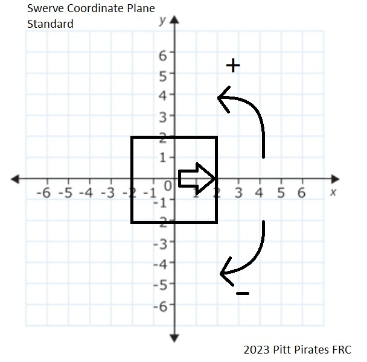

# Swerve Drive Robot Project
Pitt Pirates FRC 2023 

**Conventions**
* Standalone math functions go in MathR.java
* Constants go in Constants.java
* VectorR is the primary class used for vector operations
* All angles are in degrees unless specified in the variable/function name
* All angles follow the coordinate plane
* All vectors follow the coordinate plane, WHERE the robot's front is on the +X axis
* Commands are responsible for max speed setting
* Methods starting with `update` must be called periodically
* Methods starting with `debug` are used for testing
* All variables & methods are to be made `private` unless a higher access modifier is needed.

